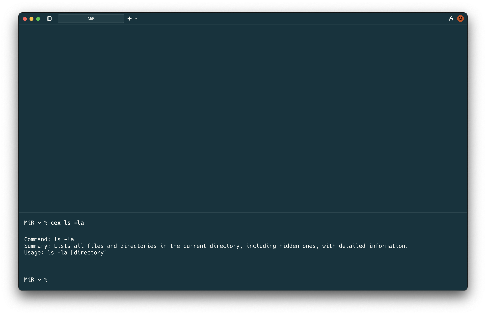

# CMD Explain

A simple **CLI** tool that explains any shell command using **GPT-4o**.
Perfect for learning new commands or understanding complex terminal operations.

## Features

-  AI-powered command explanations using GPT-4o
-  Fast and lightweight
-  Clean, terminal-friendly output format

## Installation

### From Source

```bash
git clone https://github.com/MahdiMirshafiee/cmd-explain.git
cd cmd-explain
npm install
npm link
```

## Setup

1. Get an API key from [`openRouter`](https://openrouter.ai/)
2. Create a `.env` file in the project directory:
```bash
API_TOKEN=your_openrouter_api_key_here
```
## Usage

You can use either command name:
```bash
# Full command name
cmdexplain <your-command>

# Short alias
cex <your-command>
```
## Examples
```bash
# Explain a simple command
```
# 

```bash
# Explain a complex command
```
# 

## Help
```bash
cmdexplain --help
# or
cex -h
```
## Contributing
1. Fork the repository
2. Create your feature branch (`git checkout -b feature/amazing-feature`)
3. Commit your changes (`git commit -m 'Add some amazing feature'`)
4. Push to the branch (`git push origin feature/amazing-feature`)
5. Open a Pull Request

## License
This project is licensed under the MIT License – see the [LICENSE](./LICENSE) file for details.
